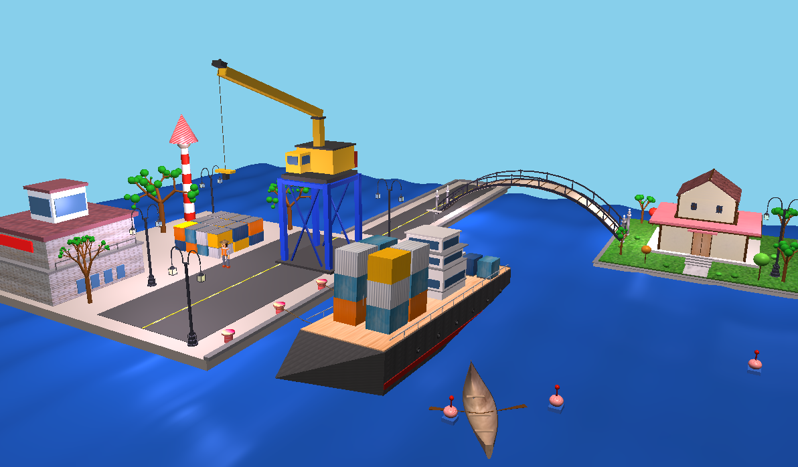
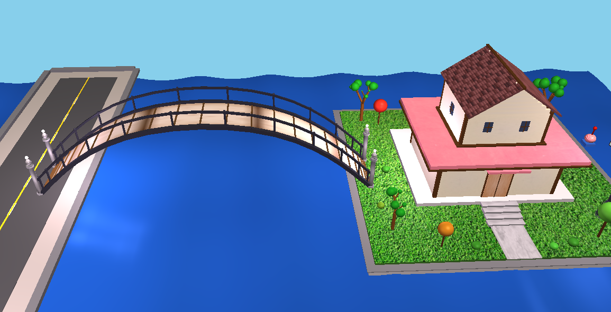
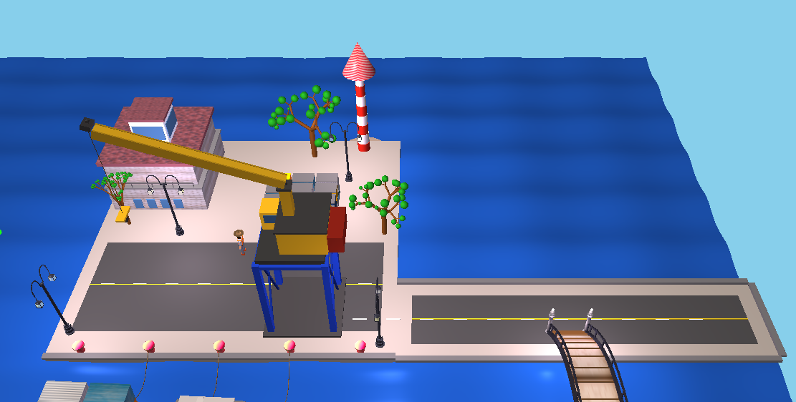
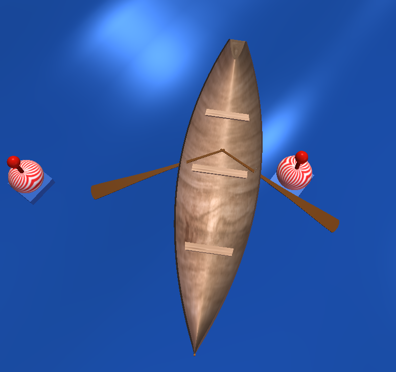
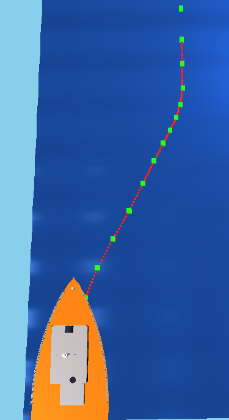
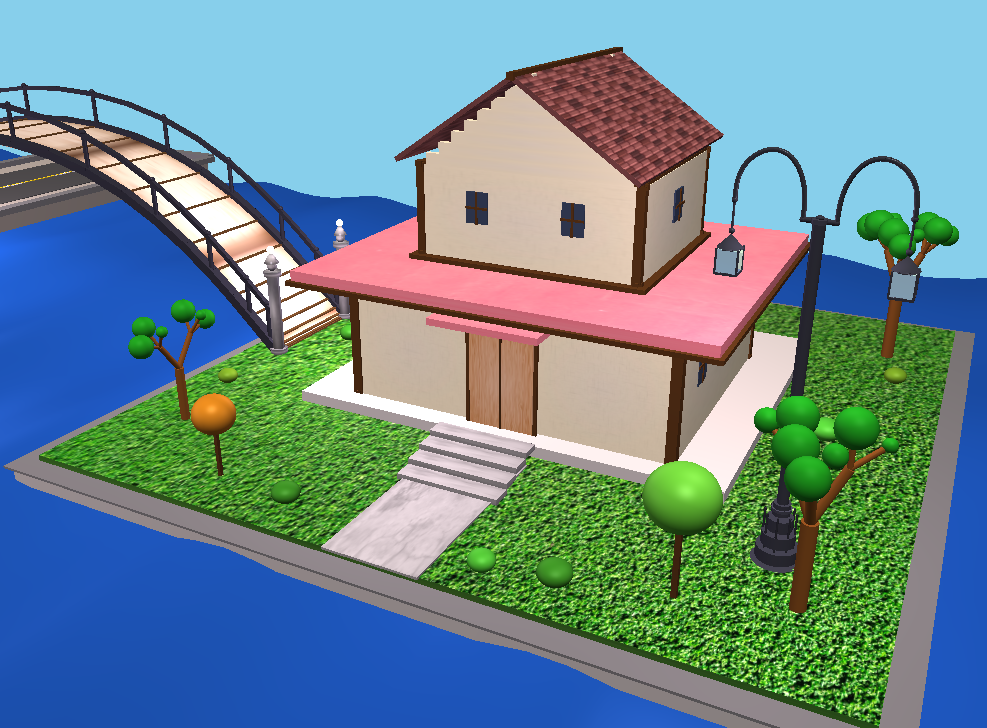
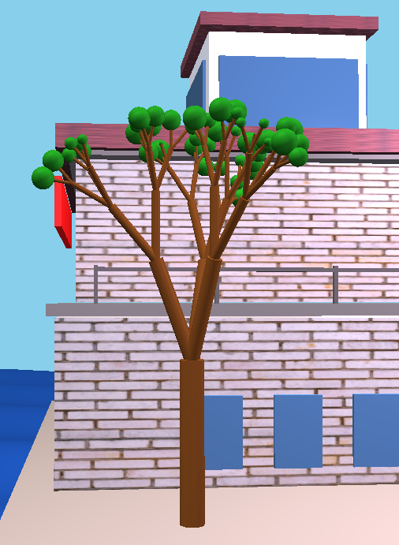
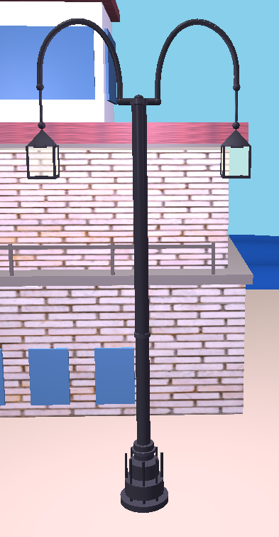
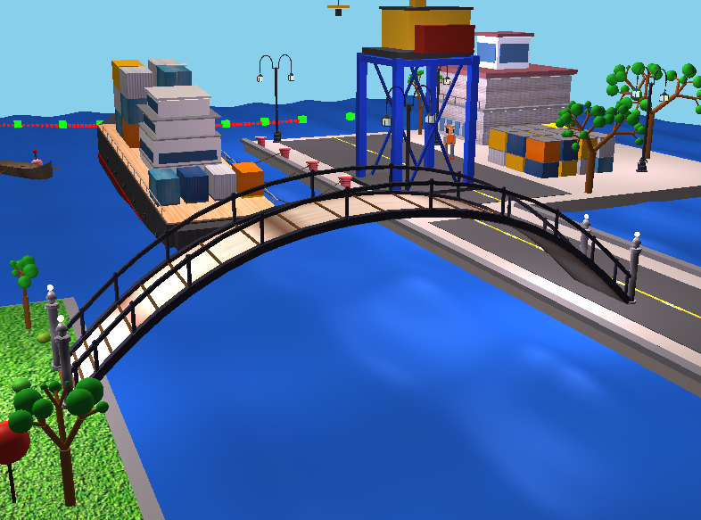
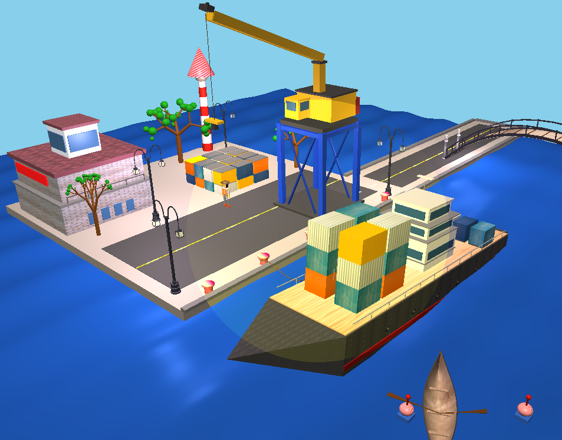

# 🌊 SeaForge: 3D Interactive Harbor Simulation

## 📌 Overview
**SeaForge** is a real-time 3D harbor simulation that integrates physics-based interactions, dynamic environments, and interactive controls.  
It focuses on realistic water behavior, ship dynamics, and visually rich rendering using modern graphics techniques.

  

  

---
## 🎯 Objectives
- Develop a real-time 3D port simulation  
- Implement realistic wave dynamics and vessel–water interaction  
- Create an interactive environment with user control  
- Add dynamic lighting, texturing, and dual shading models  
- Demonstrate physics-driven behaviors like instability and sinking  

---

## 🧰 Tools & Technologies
- C++  
- OpenGL 3.3  
- GLSL (Shader Programming)  
- GLFW (Window & Input Handling)  
- GLAD (OpenGL Loader)  
- GLM (Math Library)  
- stb_image (Texture Loading)  

---

## 🌊 Water Simulation
- Grid-based water surface  
- Vertex shader uses sine/cosine waves (Gerstner-like)  
- Multiple waves combined for realism  
- Normals approximated for proper lighting  

---

## 🚢 Ship Motion & Physics
- Wave-based motion (Pitch, Roll, Heave)  
- Velocity, inertia, and drag-based movement  
- Turning with realistic pivot  
- Buoyancy using Archimedes’ principle  

---

## 📦 Container & Stability System
- Weight-based container distribution  
- Center of mass affects ship balance  
- Uneven load causes tilt or capsize  
- Overload can sink the ship  

  

---

## 🚣 Boat Simulation
- Oar-based movement system  
- Drag force propels the boat  
- One oar → turning, both → straight motion  
- Natural slowdown due to water resistance  

  

---

## 🛳️ Path Movement
- Ship follows cubic B-spline curve  
- Smooth and continuous path  
- Control points define trajectory  

  

---

## 🏗️ Crane System
- Hook behaves like a pendulum  
- Rope modeled using Catmull-Rom spline  
- Natural swinging motion  

  

---

## 🎨 Texturing
- Applied on buildings, ships, roads, environment  
- Blending between material color and texture  

  

---

## 🧱 Complex Objects
- Lighthouse (cone + sphere + cylinder)  
- Fractal trees  
- Ships using Bezier & lofted surfaces  

  
  

  

---

## 💡 Lighting
- Directional Light  
- Point Light  
- Spot Light  
- Ambient, Diffuse, Specular components  

  

---

## 🖌️ Shading
- Phong Shading  
- Gouraud Shading  

---

## 👁️ Views
- Isometric View  
- Top View  
- Front View  

---

## 🎬 Features Summary
- Realistic physics simulation  
- Dynamic lighting & shading  
- Interactive controls  
- Procedural and spline-based motion  
- Complex object modeling  

---

## 📌 Conclusion
- Successful procedural generation  
- Realistic physics integration  
- High visual fidelity  
- Interactive and autonomous systems  

---

## 📁 Resources
**There are Reports, Presentation (Unzip the Presentation Zip) and Codes**
